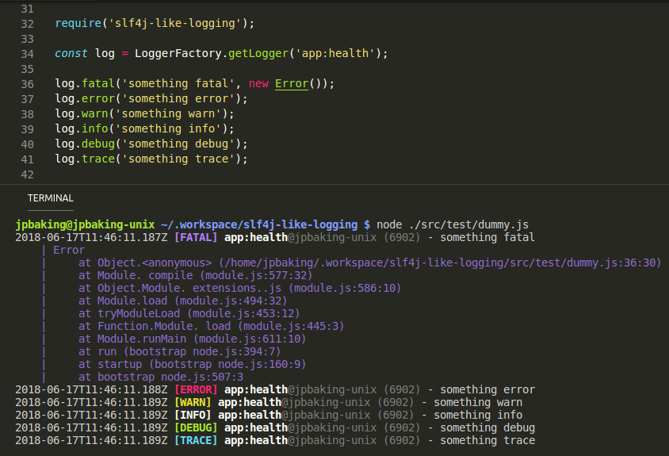

# slf4n-logging

## Simple Logging Facade for NodeJS

Emulating Simple Logging Facade for Java (SLF4J)



## This shiz is asynchronous!

Yes, logger functions' implementation for writing to streams won't be a blocker.

Every log method returns a [bluebird `Promise`](https://www.npmjs.com/package/bluebird) -- for those that want to "wait" for logs to be written before proceding to next lines.

_[slf4n-logging](https://github.com/jpbaking/slf4n-logging) by [jpbaking](https://github.com/jpbaking)_

## How to use?

### Basic Usage

Simply `require('slf4n-logging')` from your "main" (entrypoint) `.js` then all of other modules would get the global `LoggerFactory`.

Sample File #1: `app.js`
```javascript
require('slf4n-logging');
```

Sample File #2: `api/controller/health.js`
```javascript
const log = LoggerFactory.getLogger('app:health');
// ...
log.debug('some debug line %s', aStringVariable);
log.debug('some debug line %o', anObjectOrArray);
// ...
log.error('some error line', error);
```

#### Formatting in `log.{level}([data][, ...args])`

As shown in the example above, syntax for log-level functions exactly the same as [`require('util').format(format[, ...args])`](https://nodejs.org/api/util.html#util_util_format_format_args) and [`console.log([data][, ...args])`](https://nodejs.org/api/console.html#console_console_log_data_args).

### Safe Usage

Some do not like adding anything to `global.*`. If you're one of those, you may use `require('slf4n-logging/safe')` instead:

Sample File: `api/helpers/UltimateHelper.js`
```javascript
const log = require('slf4n-logging/safe')('app:ultimate');
// ...
log.info('some info line');
// ...
log.warn('some warn line', error);
```

### "Manual" Usage

Sample `loggerConfig` object:
```javascript
// example 
const loggerConfig = {
  layout: '[:level] :timestamp :logger - :message:error',
  errorIndenter: '    > ',
  level: 'trace',
  colors: {
    enabled: 'true',
    fatal: 'magenta',
    error: 'red',
    warn: 'yellow',
    info: 'white',
    debug: 'cyan',
    trace: 'green'
  },
  stream: 'stderr',
  terminateOnFail: 'true'
}
```

Sample `global.LoggerFactory` _(unsafe)_:
```javascript
// logger factory
// unsafe usage (`global.LoggerFactory` is set)
require('slf4n-logging/json')(loggerConfig, false);
// default is `false` for `safe` (second argument)
require('slf4n-logging/json')(loggerConfig);

// actual logger
const log = LoggerFactory.getLogger('app:something');
// ...
log.debug('some debug line');
// ...
log.error('some error line', error);
```

Sample **safe** usage _(returns a `LoggerFactory`; same one that would've been set to `global.*`)_:
```javascript
// logger factory
const LoggerFactory = require('slf4n-logging/json')(loggerConfig, true);

// actual logger
const log = LoggerFactory.getLogger('app:something');
// ...
log.trace('some trace line');
// ...
log.fatal('some fatal line', error);
```

## The `log.{level}([data][, ...args])` functions

As described earlier, just use `log.{level}([data][, ...args])` functions very much like how you'd use [`console.log([data][, ...args])`](https://nodejs.org/api/console.html#console_console_log_data_args).

```javascript
const log = LoggerFactory.getLogger('app:something');
// ...
try {
  log.trace('something trace %s', aString);
  log.debug('something debug %o', anObject);
  log.info('something info');
  log.warn('something warn %d', aNumber);
  // ...
} catch (error) {
  log.fatal('something fatal', error);
  log.error('something error', error);
}
```

Here's a list of available `log.{level}([data][, ...args])` functions:

- **`log.fatal([data][, ...args])`** - log something at fatal level
- **`log.error([data][, ...args])`** - log something at error level
- **`log.warn([data][, ...args])`** - log something at warn level
- **`log.info([data][, ...args])`** - log something at info level
- **`log.debug([data][, ...args])`** - log something at debug level
- **`log.trace([data][, ...args])`** - log something at trace level

## The `log.is{level}Enabled()` function

Intended string/s to log are expensive to generate outside of [util.format()](https://nodejs.org/api/util.html#util_util_format_format_args)? Check if level can be logged in the first place!!!

```javascript
const log = LoggerFactory.getLogger('app:something');
// ...
if (log.isTraceEnabled()) {
  log.trace('Stats:\n%s', someHeavyStatistics.snapshot().prettyPrint());
}
```

In the example above, `#snapshot()` and/or `#prettyPrint()` is expensive to execute; hence, checking if the log level is enabled **first**.

- **`#isFatalEnabled()`** - check if fatal is enabled
- **`#isErrorEnabled()`** - check if error is enabled
- **`#isWarnEnabled()`** - check if warn is enabled
- **`#isInfoEnabled()`** - check if info is enabled
- **`#isDebugEnabled()`** - check if debug is enabled
- **`#isTraceEnabled()`** - check if trace is enabled

## Configuration

### Environment Variables

Here are the environment variables that can be set to configure `slf4n-logging`:

#### `LOG_LAYOUT`

> **"Manual" Usage** JSON Path: `<root>.layout`

The layout / pattern for every log line written.

> **`:timestamp [:level] :logger@:hostname (:pid) - :message:error`**

Placeholders:
- **`:timestamp`** - is replaced by ISO8601 date string _(ie.: `2018-06-17T10:38:19.336Z`)_
- **`:level`** - the level or verbosity of logs allowed to be written
- **`:logger`** - the `loggerName`
- **`:hostname`** - the machine hostname from where app is running
- **`:pid`** - the process ID (PID) of running app
- **`:message`** - the message to be logged
- **`:error`** - to show/print error and/or `error.stack`
- **`:[n]`** - new-line

Color placeholders:

| FORMATS          | FOREGROUND       | BACKGROUND       |
| ---------------- | ---------------- | ---------------- |
| `:c[reset]`      | `:c[black]`      | `:c[bg.black]`   |
| `:c[bold]`       | `:c[red]`        | `:c[bg.red]`     |
| `:c[dim]`        | `:c[green]`      | `:c[bg.green]`   |
| `:c[underscore]` | `:c[yellow]`     | `:c[bg.yellow]`  |
| `:c[blink]`      | `:c[blue]`       | `:c[bg.blue]`    |
| `:c[reverse]`    | `:c[magenta]`    | `:c[bg.magenta]` |
| `:c[hidden]`     | `:c[cyan]`       | `:c[bg.cyan]`    |
|                  | `:c[white]`      | `:c[bg.white]`   |

How to color? Here's a sample:

> **`:c[bold]:c[level][:level]:c[reset] :logger - :message:c[level]:error`**

It'll look like:


#### `LOG_LEVEL`

> **"Manual" Usage** JSON Path: `<root>.level`

The "max" level or verbosity of logs allowed to be written. Better explained by the list of accepted values below:

- **`OFF`** - nothing will be printed
- **`FATAL`** - only level `FATAL` will be printed
- **`ERROR`** - levels `ERROR`, `FATAL`, will be printed
- **`WARN`** - levels `WARN`, `ERROR`, `FATAL`, will be printed
- **`INFO`** - levels `INFO`, `WARN`, `ERROR`, `FATAL`, will be printed
- **`DEBUG`** - levels `DEBUG`, `INFO`, `WARN`, `ERROR`, `FATAL`, will be printed
- **`TRACE`** - levels `TRACE`, `DEBUG`, `INFO`, `WARN`, `ERROR`, `FATAL`, will be printed

Default is `INFO` if left unset.

#### `LOG_COLORS_ENABLED`

> **"Manual" Usage** JSON Path: `<root>.colors.enabled`

To enable/disable colors in logging. Note that setting this to `true` will **NOT** override printing colors over non-TTY terminals/consoles/streams _(if stream is **NOT** TTY, colors won't be printed)_.

- **`true`** - colors (`:c[*]`) will be printed
- **`false`** - no color will be printed

Default is `true` if left unset.

#### `LOG_COLORS_{level}`

> **"Manual" Usage** JSON Path: `<root>.colors.{level_in_lowercase}`
>  - `<root>.colors.fatal`
>  - `<root>.colors.error`
>  - `<root>.colors.warn`
>  - `<root>.colors.info`
>  - `<root>.colors.debug`
>  - `<root>.colors.trace`

- **`LOG_COLORS_FATAL`** - color to be used for `FATAL` level logs _(default: magenta)_
- **`LOG_COLORS_ERROR`** - color to be used for `ERROR` level logs _(default: red)_
- **`LOG_COLORS_WARN`** - color to be used for `WARN` level logs _(default: yellow)_
- **`LOG_COLORS_INFO`** - color to be used for `INFO` level logs _(default: white)_
- **`LOG_COLORS_DEBUG`** - color to be used for `DEBUG` level logs _(default: green)_
- **`LOG_COLORS_TRACE`** - color to be used for `TRACE` level logs _(default: cyan)_

Here are the valid colors:

| FORMATS    | FOREGROUND | BACKGROUND |
| ---------- | ---------- | ---------- |
| reset      | black      | bg.black   |
| bold       | red        | bg.red     |
| dim        | green      | bg.green   |
| underscore | yellow     | bg.yellow  |
| blink      | blue       | bg.blue    |
| reverse    | magenta    | bg.magenta |
| hidden     | cyan       | bg.cyan    |
|            | white      | bg.white   |

#### `LOG_ERROR_INDENTER`

> **"Manual" Usage** JSON Path: `<root>.errorIndenter`

Used to indent error stack. "`    | `" _(the default; four spaces, a pipe, then a space)_ would appear like:


Not really necessary, sure there's overhead, but does look nice `:P` _(improves readability for some)_

#### `LOG_STREAM`

> **"Manual" Usage** JSON Path: `<root>.stream`

Dictates which stream (`stdout` and/or `stderr`) to route log writing. 

| LOG_STREAM     | "out"            | "err"            |
| -------------- | ---------------- | ---------------- |
| **`DEFAULT`**  | `process.stdout` | `process.stdout` |
| **`STDOUT`**   | `process.stdout` | `process.stdout` |
| **`STDERR`**   | `process.stderr` | `process.stderr` |
| **`STANDARD`** | `process.stdout` | `process.stderr` |

> **`FATAL`** and **`ERROR`** are logged to "err" streams.
> 
> **`WARN`**, **`INFO`**, **`DEBUG`**, and **`TRACE`**, are logged to "out" streams.

#### `LOG_TERMINATE_ON_FAIL`

> **"Manual" Usage** JSON Path: `<root>.terminateOnFail`

Basically, whether or not to terminate running app if writing logs into stream fails.

- **`true`** - duh?
- **`false`** - duh?

Default is `true` if left unset.

## License

MIT License

Copyright (c) 2018 Joseph Baking

Permission is hereby granted, free of charge, to any person obtaining a copy of this software and associated documentation files (the "Software"), to deal in the Software without restriction, including without limitation the rights to use, copy, modify, merge, publish, distribute, sublicense, and/or sell copies of the Software, and to permit persons to whom the Software is furnished to do so, subject to the following conditions:

The above copyright notice and this permission notice shall be included in all copies or substantial portions of the Software.

THE SOFTWARE IS PROVIDED "AS IS", WITHOUT WARRANTY OF ANY KIND, EXPRESS OR IMPLIED, INCLUDING BUT NOT LIMITED TO THE WARRANTIES OF MERCHANTABILITY, FITNESS FOR A PARTICULAR PURPOSE AND NONINFRINGEMENT. IN NO EVENT SHALL THE AUTHORS OR COPYRIGHT HOLDERS BE LIABLE FOR ANY CLAIM, DAMAGES OR OTHER LIABILITY, WHETHER IN AN ACTION OF CONTRACT, TORT OR OTHERWISE, ARISING FROM, OUT OF OR IN CONNECTION WITH THE SOFTWARE OR THE USE OR OTHER DEALINGS IN THE SOFTWARE.
